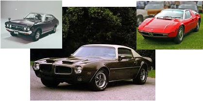
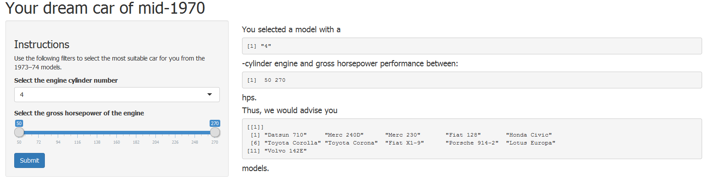

"Your dream car of mid-1970th" Shiny App
========================================================
author: Andrii Daniliuk
date: February 18th 2015
transition: rotate

Have you ever dream of...
========================================================

coming to mid-1970th? Marvelous time, great life, cool 
cars... The choice is hard, but it's always better
**driving** then walking, isn't it?

We have a special App just for you - **"Your dream car"**




Data used
========================================================

For your better choice we selected the car models of
1973-1974 described at 'mtcars' dataset in R


```r
library(datasets)
data(mtcars)
head(mtcars[,c(1:6)],4)
```

```
                mpg cyl disp  hp drat    wt
Mazda RX4      21.0   6  160 110 3.90 2.620
Mazda RX4 Wag  21.0   6  160 110 3.90 2.875
Datsun 710     22.8   4  108  93 3.85 2.320
Hornet 4 Drive 21.4   6  258 110 3.08 3.215
```

Your selection
========================================================

By selecting only two parameters - *number of cylinders*
(cyl) and *gross horsepower range* (hp) you will get our
prompt advice on the model selection by clicking "Submit"
button



Now you know what you want
========================================================

Now the car models are selected, so let's

**DRIVE**

wherever you want!!!

Thanks for your choice and see ya! :)
